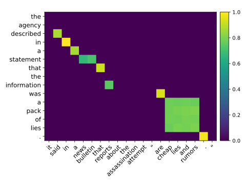

# OTAlign: Optimal Transport based Monolingual Word Alignment


# Prerequisite
- See `src/requirements.txt`
- Please collect word alignment datasets: MultiMWA, Edinburgh++, MSR-RTE
  - Place them in a `data/` directory
  - Preprocessing codes for Edinburgh++ and MSR-RTE are in `src/preprocess`

# Unsupervised Word Alignment
For details, please refer to the arguments in `src/unsupervised_alignment.py`
``` shell
UN_OUTDIR=../out/unsupervised/
SEED=42
DATA=mtref
OT=uot
WT=uniform
DT=cos
$ python unsupervised_alignment.py --data $DATA --sure_and_possible --model bert-base-uncased --centering --pair_encode --layer -3 --out $UN_OUTDIR --ot_type $OT --weight_type $WT --dist_type $DT --seed $SEED
```
# Supervised Word Alignment
For details, please refer to the arguments in `src/supervised_alignment.py`

**Note**
Supervised word alignment uses hyperparameters estimated in the unsupervised setting. You first need to run unsupervised word alignment. 


``` shell
SU_OUTDIR=../out/supervised/
BATCH=64
PATIENCE=5

$ python python supervised_alignment.py --batch $BATCH --out $SU_OUTDIR --data $DATA --sure_and_possible --model bert-base-uncased --ot_type $OT --weight_type $WT --dist_type $DT --seed $SEED --patience $PATIENCE --unsupervised_dir $SU_OUTDIR
```

# Citation
Please cite our ACL2023 paper if you use this repository:
> Yuki Arase, Han Bao, and Sho Yokoi. Unbalanced Optimal Transport for Unbalanced Word Alignment, in Proc. of the Annual Meeting of the Association for Computational Linguistics (ACL 2023), (July 2023, to appear). 

# Contact 
If you have any questions about codes in this repository, please contact Yuki Arase via email or simply post an issue :speech_balloon:

